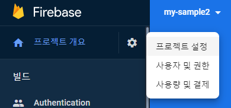
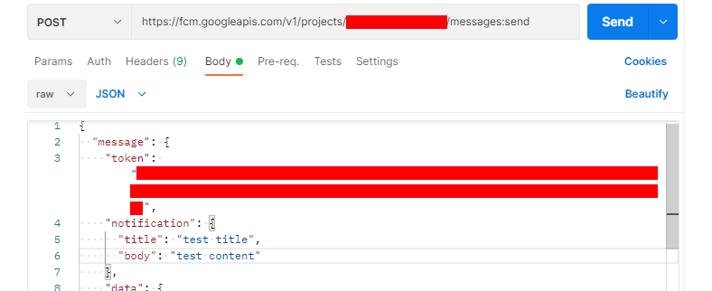

# 파이어베이스 앱 등록 및 sdk 초기화 정보 확인 방법
1. https://console.firebase.google.com/?hl=ko 에 접속합니다.
2. "프로젝트 추가"를 클릭하여 프로젝트를 생성합니다.
3. 프로젝트 overview 페이지에서 프로젝트 설정을 클릭합니다.<br />
&nbsp;&nbsp;

4. 맨 아래로 스크롤 하여 웹앱 추가 버튼을 클릭합니다. <br />
&nbsp;&nbsp;

5. 웹앱 등록 후 다시 프로젝트 설정 페이지로 돌아가 맨 아래로 스크롤하면 다음과 같이 firebase 초기화에 필요한 정보를 확인 할 수 있습니다.<br />
&nbsp;&nbsp;

<br />
<br />

# 이 프로젝트 사용 방법
1. 본 프로젝트를 git pull 받습니다.
```
git clone https://github.com/wisdomstar94/google-fcm-web-bundle-sample.git
```
2. 클론 받은 프로젝트 경로로 이동합니다.
```
cd google-fcm-web-bundle-sample
```
3. node package 를 설치합니다.
```
npm i
```
4. 다음과 같이 파일을 copy 합니다.
```
copy .env.sample .env
```
5. .env 파일 안에 있는 값들을 적절히 수정해줍니다.<br />

| 변수명 | 의미 |
| --- | --- |
| FIREBASE_apiKey | firebase sdk 설정값중 apiKey 에 해당하는 값을 넣어주세요. |
| FIREBASE_authDomain | firebase sdk 설정값중 authDomain 에 해당하는 값을 넣어주세요. |
| FIREBASE_projectId | firebase sdk 설정값중 projectId 에 해당하는 값을 넣어주세요. |
| FIREBASE_storageBucket | firebase sdk 설정값중 storageBucket 에 해당하는 값을 넣어주세요. |
| FIREBASE_messagingSenderId | firebase sdk 설정값중 messagingSenderId 에 해당하는 값을 넣어주세요. |
| FIREBASE_appId | firebase sdk 설정값중 appId 에 해당하는 값을 넣어주세요. |
| FIREBASE_MESSAGING_SW_JS_FILE_PATH | firebase-messaging-sw.js 파일이 루트 경로에 있지 않은 경우에만 이 값을 수정하시면 됩니다. |


6. 다음 명령어들을 입력해 ts 파일을 js 파일로 번들링 합니다.
```
npm run build:firebase-messaging-sw
```
```
npm run build:fcm
```

7. 다음과 같이 fcm.js 파일과 firebase-messaging-sw.js 파일이 생성된 것을 확인 할 수 있습니다. <br />
&nbsp;&nbsp;

8. 프로젝트를 구동합니다.
```
node app.js
```
9. http://localhost:8990 에 접속하면 다음과 같이 알림에 대한 요청이 표시됩니다.<br />
&nbsp;&nbsp;

10. 허용을 클릭 한 후 [개발자도구] 의 console 탭을 보면 token 이 표시된 것을 확인 할 수 있습니다.<br />
&nbsp;&nbsp;

11. POSTMAN 을 실행합니다.<br />
&nbsp;&nbsp;

12. request 아이템을 하나 생성하고 REST API 정보를 다음과 같이 입력합니다.<br />
- url
```
[POST] https://fcm.googleapis.com/v1/projects/{{ 프로젝트 ID }}/messages:send
```

- header
```
Authorization: Bearer {{ access token 을 입력해주세요. }}
```
access token 은 "https://github.com/wisdomstar94/google-web-login-sample" 대로 따라하시면 획득 가능합니다. 그리고 firebase messaging 을 보내는 기능을 이용하기 위해선 scope 에 "https://www.googleapis.com/auth/firebase.messaging" 가 필요합니다.

- payload
```
{
  "message": {
    "token": "{{ 콘솔 창에서 확인한 token 을 입력합니다. }}",
      "notification": {
      "title": "테스트 메시지 제목입니다.",
      "body": "테스트 메시지 내용입니다."
    },
    "data": {
      "var1": "부가 데이터 입니다."
    }
  }
}
```
13. 위와 같이 REST API를 설정 후 SEND 버튼을 눌러 API 를 호출합니다. <br />
&nbsp;&nbsp;

14. 그럼 다음과 같이 브라우저의 콘솔탭에서 foreground 상태일 때의 메시지를 수신 받는 것을 확인 할 수 있습니다. <br />
&nbsp;&nbsp;

15. 그럼 이번엔 브라우저를 최소화 하고 동일하게 API 를 호출합니다.
16. 그럼 다음과 같이 브라우저 자체에서 알림이 오며, 브라우저를 다시 활성화하고 콘솔 탭을 보면 background 상태일 때의 메시지를 수신 받는 것을 확인 할 수 있습니다. <br />
&nbsp;&nbsp; <br />
&nbsp;&nbsp;

17. 이제 여러분들의 서비스에 맞게 커스텀하시려면 .env 파일, src/fcm.ts 파일 src/firebase-messaging-sw.ts 파일을 적절히 수정하신 후 마찬가지로 js 파일로 번들링 하신 뒤 번들링 된 js 파일을 여러분들의 프로젝트에서 사용하시면 됩니다. :)
